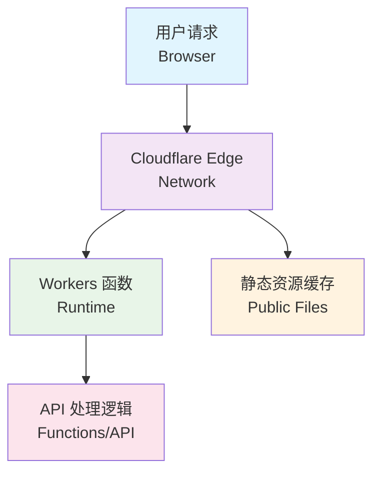

# Kiro Token Tools

一个基于 Cloudflare Workers 的 Kiro Token 处理工具。

## 项目简介

这是一个专门用于处理 Kiro IDE Token 的在线工具，支持用量查询和 Token 格式转换。基于 Cloudflare Workers 构建，提供快速、安全的边缘计算服务。

## 功能特性

- 🔍 **用量查询** - 查看 Kiro IDE 的使用限额和剩余量
- 🔄 **Token 转换** - 将各种格式的 Token 转换为标准格式
- 🔒 **安全可靠** - 基于 Cloudflare Workers，不存储任何敏感数据
- 📱 **响应式设计** - 支持深色/浅色主题，适配各种设备
- ⚡ **快速处理** - 边缘计算，全球加速访问

## 技术栈

- **运行时**: Cloudflare Workers
- **部署工具**: Wrangler CLI / Cloudflare Dashboard
- **语言**: JavaScript

## 架构图



## 项目结构

```
kiro-token-tools/
├── functions/
│   └── api/
│       └── process.js      # Token 处理 API
├── public/
│   └── index.html          # 前端界面
├── _routes.json            # 路由配置
├── wrangler.toml           # Wrangler 配置文件
├── LICENSE                 # MIT 许可证
└── README.md               # 项目说明
```

## 快速开始

### 环境要求

- Node.js 16+
- npm 或 yarn
- Wrangler CLI

### 安装依赖

```bash
npm install -g wrangler
```

### 本地开发

```bash
# 启动开发服务器
wrangler dev

# 或者指定端口
wrangler dev --port 8080
```

### 部署

#### 方式一：命令行部署（推荐）

```bash
# 部署到 Cloudflare Workers
wrangler deploy
```

#### 方式二：Cloudflare 网页端部署

1. **登录 Cloudflare Dashboard**
   - 访问 [Cloudflare Dashboard](https://dash.cloudflare.com/)
   - 登录你的账户

2. **创建 Workers 应用**
   - 进入 `Workers & Pages` 页面
   - 点击 `Create application`
   - 选择 `Pages` 标签
   - 点击 `Connect to Git`

3. **连接 GitHub 仓库**
   - 选择 `GitHub` 作为 Git 提供商
   - 授权 Cloudflare 访问你的 GitHub 账户
   - 选择 `kiroTools` 仓库
   - 点击 `Begin setup`

4. **配置部署设置**
   - **Project name**: `kiro-token-tools`（或自定义名称）
   - **Production branch**: `main`
   - **Framework preset**: `None`
   - **Build command**: 留空
   - **Build output directory**: `public`

5. **部署项目**
   - 点击 `Save and Deploy`
   - 等待部署完成
   - 获得部署 URL：`https://kiro-token-tools.pages.dev`

6. **后续更新**
   - 每次推送到 `main` 分支时自动重新部署
   - 可在 Cloudflare Dashboard 中查看部署历史和日志

## 配置

在 `wrangler.toml` 文件中配置你的项目设置：

- `name`: 项目名称
- `compatibility_date`: 兼容性日期
- `compatibility_flags`: 兼容性标志

## API 端点

- `GET /` - 主页面（Token 处理界面）
- `POST /api/process` - Token 处理接口
  - 支持多种 Token 格式输入
  - 返回用量信息和转换后的 Token

## 开发说明

### 添加新功能

1. 在 `functions/api/` 目录下创建新的处理函数
2. 更新 `_routes.json` 配置路由（如需要）
3. 在 `public/index.html` 中添加前端界面
4. 测试功能
5. 部署到生产环境

### 支持的 Token 格式

工具支持以下输入格式：

- **JSON 格式**: `{"refreshToken": "xxx", "provider": "Google"}`
- **中文格式**: `账号：{"email":"xxx"}登录token：{"refreshToken":"xxx"}`
- **管道格式**: `{"email":"xxx"}|{"refreshToken":"xxx"}`
- **BuilderId 格式**: 需要包含 `clientId` 和 `clientSecret`

### 环境变量

在 Cloudflare Workers 控制台中设置环境变量，或在 `wrangler.toml` 中配置。

## 贡献

欢迎提交 Issue 和 Pull Request。

## 许可证

[MIT License](LICENSE)

## 联系方式

如有问题，请通过 GitHub Issues 联系。

---
*Made with ❤️ by Filatest*